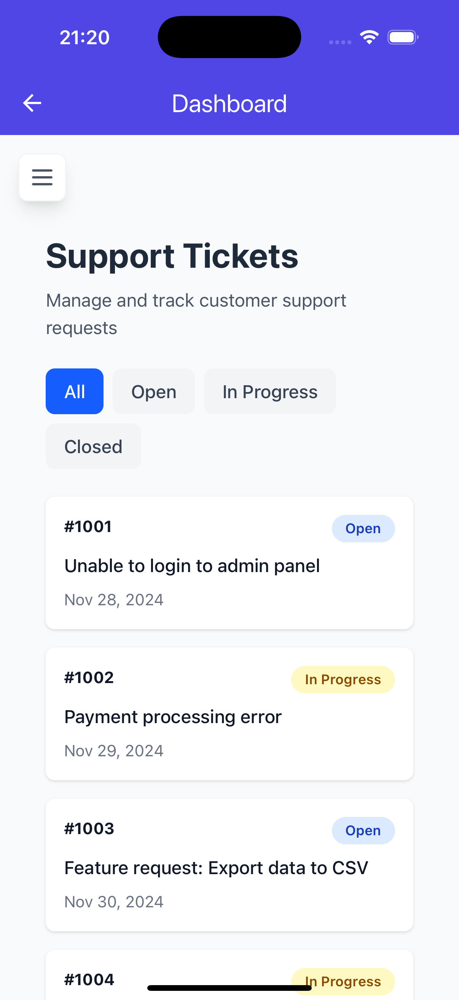
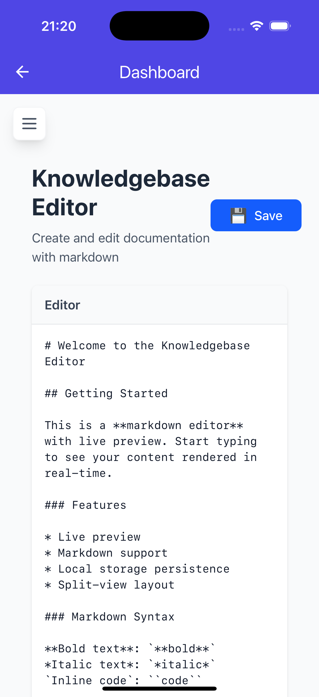
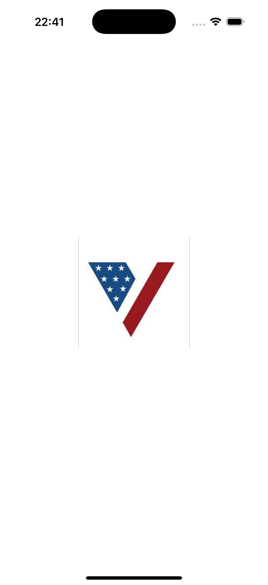

# TurboVets Messaging App

A beautiful, production-ready Flutter messaging app with clean MVVM architecture, Hive database persistence, custom splash screen, and emoji support.


## ✨ Features

### Core Features
- 💬 **Real-time Chat Interface** - Beautiful gradient AppBar with agent status
- 🤖 **Auto-Reply System** - 30+ customer service responses
- 🌐 **In-App WebView** - Dashboard integration
- 🎨 **Material Design 3** - Modern, polished UI
- 🏗️ **MVVM Architecture** - ViewModel pattern with ChangeNotifier

### Bonus Features
- 💾 **Hive Database** - Fast, type-safe NoSQL persistence
- 🔔 **Notification Badge** - Real-time unread message counter
- 😊 **Emoji Support** - Full emoji picker integration
- 🖼️ **Image Messages** - Infrastructure ready for photo sharing
- 🚀 **Custom Splash Screen** - Animated logo with zoom-in effect
- 📱 **Custom App Icon** - Branded TurboVets logo

## 📱 Screenshots

<div align="center">
  <table>
    <tr>
      <td align="center" width="25%">
        <video src="screenshots/app_demo.mov" controls width="200"></video>
        <br/>
        <sub><b>App Demo</b></sub>
      </td>
      <td align="center" width="25%">
        
        <br/>
        <sub><b>Splash Screen</b></sub>
      </td>
      <td align="center" width="25%">
        
        <br/>
        <sub><b>Chat Interface</b></sub>
      </td>
      <td align="center" width="25%">
        
        <br/>
        <sub><b>Messaging Screen</b></sub>
      </td>
    </tr>
    <tr>
      <td align="center" width="25%">
        
        <br/>
        <sub><b>Emoji Selection</b></sub>
      </td>
      <td align="center" width="25%">
        
        <br/>
        <sub><b>Emoji Picker</b></sub>
      </td>
      <td align="center" width="25%">
        
        <br/>
        <sub><b>Notification Badge</b></sub>
      </td>
      <td align="center" width="25%">
      </td>
    </tr>
  </table>
</div>

## 🏗️ Architecture

Clean MVVM architecture with clear separation of concerns:

```
lib/
├── main.dart                           # App entry + Hive initialization
├── models/
│   ├── message.dart                   # Message model with Hive annotations
│   └── message.g.dart                 # Generated Hive adapter
├── services/
│   └── message_service.dart           # Hive-based persistence service
├── utils/
│   └── message_constants.dart         # 30+ auto-reply messages
├── widgets/
│   ├── message_bubble.dart            # Multi-type message display
│   └── chat_input.dart                # Input with emoji button
└── screens/
    ├── splash_screen.dart             # Animated splash with zoom effect
    ├── dashboard_screen.dart          # In-app WebView
    └── messaging/
        ├── messaging_screen.dart      # Chat UI (uses ViewModel)
        ├── messaging_viewmodel.dart   # State management with ChangeNotifier
        └── components/
            ├── chat_app_bar.dart      # Custom gradient AppBar
            ├── message_list.dart      # Scrollable message list
            ├── emoji_picker_panel.dart # Emoji picker component
            ├── notification_badge.dart # Reusable badge widget
            └── agent_status_indicator.dart # Online/offline indicator
```

## 🚀 Getting Started

### Prerequisites

- Flutter SDK 3.8.1 or higher
- Dart 3.0 or higher
- iOS Simulator, Android Emulator, or physical device

### Installation

1. **Clone the repository**
```bash
git clone <your-repo-url>
cd turbovets_app
```

2. **Install dependencies**
```bash
flutter pub get
```

3. **Generate Hive adapters**
```bash
flutter pub run build_runner build --delete-conflicting-outputs
```

4. **Run the app**
```bash
flutter run
```

### Verify Installation

```bash
# Check for code issues
flutter analyze

# Run tests
flutter test
```

## 📦 Dependencies

### Production Dependencies
| Package | Version | Purpose |
|---------|---------|---------|
| [hive](https://pub.dev/packages/hive) | ^2.2.3 | NoSQL database |
| [hive_flutter](https://pub.dev/packages/hive_flutter) | ^1.1.0 | Flutter integration |
| [emoji_picker_flutter](https://pub.dev/packages/emoji_picker_flutter) | ^2.0.0 | Emoji picker UI |
| [image_picker](https://pub.dev/packages/image_picker) | ^1.0.7 | Image selection |
| [path_provider](https://pub.dev/packages/path_provider) | ^2.1.2 | File paths |
| [webview_flutter](https://pub.dev/packages/webview_flutter) | ^4.4.2 | WebView integration |
| [intl](https://pub.dev/packages/intl) | ^0.18.1 | Date formatting |

### Dev Dependencies
| Package | Version | Purpose |
|---------|---------|---------|
| [hive_generator](https://pub.dev/packages/hive_generator) | ^2.0.1 | Generate type adapters |
| [build_runner](https://pub.dev/packages/build_runner) | ^2.4.8 | Code generation |
| [flutter_launcher_icons](https://pub.dev/packages/flutter_launcher_icons) | ^0.13.1 | Generate app icons |
| [flutter_native_splash](https://pub.dev/packages/flutter_native_splash) | ^2.3.10 | Generate splash screens |

## 💡 Usage

### Sending Messages
1. Type your message in the input field
2. Press send button or hit Enter
3. Message appears on the right
4. Auto-reply arrives after 1.5 seconds

### Using Emojis
1. Tap the emoji button (😊)
2. Browse and select emoji
3. Emoji sent automatically
4. Picker closes

### Viewing Notifications
- Badge shows unread count
- Tap bell icon to mark all as read
- Badge updates in real-time

### Accessing Dashboard
1. Tap menu icon (☰)
2. WebView loads in-app
3. Tap back arrow to return

## 🎨 Color Scheme

| Purpose | Color | Hex Code |
|---------|-------|----------|
| Primary | Indigo-600 | `#4F46E5` |
| Primary Light | Indigo-400 | `#818CF8` |
| Success | Emerald-500 | `#10B981` |
| Background | Gray-50 | `#FAFAFA` |
| Surface | White | `#FFFFFF` |
| Text Primary | Gray-900 | `#1F2937` |
| Text Secondary | Gray-500 | `#6B7280` |

## 🔧 Configuration

### Hive Initialization

Hive is initialized in `main.dart`:

```dart
await Hive.initFlutter();
Hive.registerAdapter(MessageAdapter());
Hive.registerAdapter(MessageTypeAdapter());
await Hive.openBox<Message>('messages');
await Hive.openBox('settings');
```

### WebView URL

Update the dashboard URL in `lib/screens/dashboard_screen.dart`:

```dart
..loadRequest(Uri.parse('https://your-url-here.com'));
```

## 📊 Message Types

The app supports three message types:

- **Text** - Regular text messages
- **Emoji** - Large emoji display (32px)
- **Image** - Image thumbnails (infrastructure ready)

## 🧪 Testing

```bash
# Run all tests
flutter test

# Run with coverage
flutter test --coverage

# Analyze code
flutter analyze
```

**Current Status:** ✅ All tests passing, zero analyzer issues

## 🗄️ Database Structure

### Hive Boxes

**messages** (`Box<Message>`)
- Stores all chat messages
- Auto-sorted by timestamp
- Type-safe with generated adapters

**settings** (`Box`)
- Stores app settings
- Includes unread message count


w